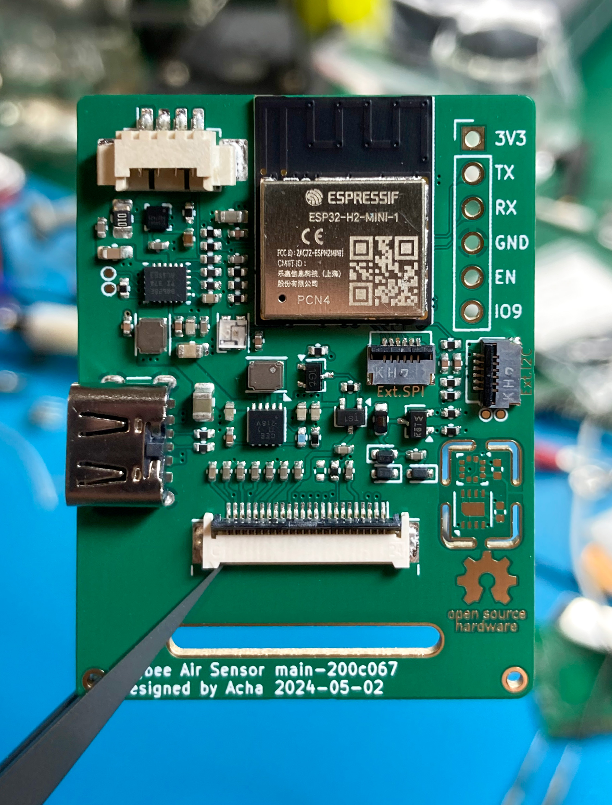

# Zigbee Air Sensor

基于 ESP32-H2 的墨水屏温湿度&气压计

相关项目(配套应用程序)(开发中)：[acha666/esp32-h2-air-sensor](https://github.com/acha666/esp32-h2-air-sensor)

## 项目进度

- [x] 验证完成

## 工程文件

请从 [Actions](https://github.com/acha666/Zigbee-Air-Sensor/actions/workflows/kicad-ci.yml) 下载 Gerber, BOM, 原理图 PDF，坐标文件以及 3D 模型文件

配套 FPC 传感器小板工程文件(嘉立创EDA专业版格式)：
* 适用于 HDC302x(SHT3x) 以及 LPS2x: [ProProject_FPC_HDC302x_LPS22_2024-05-12.epro](fpc/ProProject_FPC_HDC302x_LPS22_2024-05-12.epro)
* 适用于 SHT4x 以及 LPS2x: [ProProject_FPC_SHT4x_LPS22_2024-05-12.epro](fpc/ProProject_FPC_SHT4x_LPS22_2024-05-12.epro)
